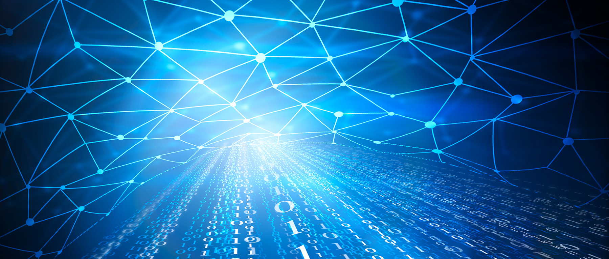

_¿Verdaderamente todas las variables que existen en nuestra realidad son al azar? ¿Decidimos sobre nuestra vida?_

No, esto no es una teoría alocada sobre si vivmos en una simulación. Es simplemente un desahogo personal de lo que llevo en la materia Simulación por computadora.

En el año pasado me fue dicho lo de difícil de la materia, pero asombrosamente (por el momento) no me he sentido tan agobiado. Quizá tenga que hablar un poco de la materia y de mi afición por las matemáticas para que todo esto tenga sentido.

Las matemáticas y yo no nos llevamos muy bien. Más que nada es el hecho de que mi memoria no es muy buena para retener información importante por mucho tiempo, si no la pongo en uso. Esto hace que los temas de matemáticas, después de llevar la materia, sean parte del pasado.

Mi carrera está muy asociada a las matemáticas, vamos, es una parte fundamental y la verdad no creo que se me den mal. El problema radica en mi maldita memoria de pez. Además ya hace 3 años que no toco temas de derivadas, integrales, matrices. Ugh.

Como se podrá deducir, la materia de Técnicas de Simulación se fundamenta en las matemáticas. Lo que se quiere simular es en sí un modelo matemático de un fenómeno estudiado. A partir de que se tiene el modelo, este se debe tratar por varios pasos hasta que se obtienen las respuestas buscadas. Hasta la fecha no hemos llegado hasta el momento de simular per se el modelo, solo hemos llegado hasta encontrar las respuestas, pero creo que falta poco para llegar a lo bonito.

### ¿Se asocia mi memoria de pez con lo que hemos visto hasta ahora?

Gracias a jebus, no.

En la materia no hemos ondado tanto en cómo funciona cada detalle de los procesos matemáticos, porque si lo hicieramos, estaría llorando mientras escribo esto. La intención del catedrático es que entendamos el proceso, del por qué del proceso es otra historia, creería que si estas interesado en estos temas y te gusta las matemáticas debe ser muy interesante. ¿Para mī? Bueno, solo quiero que el ciclo termine.

No es que me vaya mal, de hecho, dada la modalidad a distancia por el COVID-19, me está yendo muy bien. Los videos me permiten aprender a mi ritmo y esto creo que me ayuda mucho, pero lastimosamente no estoy enamorado de la materia. Es divertida, sí, pero simplemente no es lo mío.

Aunque quizá cuando vea el modelo simulado las cosas puedan cambiar... O no.
