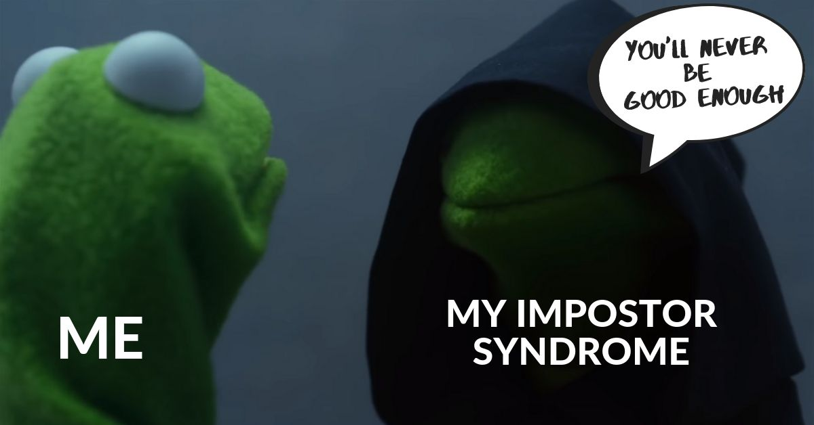

_Para ya por favor_

Vaya, llegó el momento en el que vuelvo a escribir algo aquí. Para celebrar este regreso triunfal escribiré un poco sobre lo que me viene atormentando durante toda mi carrera, el pensamiento de que no soy lo suficiente, o que no sé lo suficiente.

Podrían decir que es el "síndrome de impostor". No sé si por lo que pasa aplica a esto, así que no quiero decir que lo padezco pero lo utilizaré como referencia por simplificar las cosas. Y porque con ello le puedo dar temática a esto.

## Volvió el blog

Primero quiero escribir un poco de lo que pasé para poder escribir otra vez. Ayer haciendo mi cv y haciendo un portafolios de proyecto ingresé al blog y me puse a revisar si habían comentarios. Al principio había creado unas cloud functions en firebase para que me notificara cuando alguien comentara algun post, pero hace unos meses firebase cambió cómo funcionaban, porque ahora piden que el proyecto sea pay as you go, cosa que entiendo completamente, pero no quería hacerlo por si llegase a ocurrir algo raro.

Mi solución a lo anterior fue relativamente simple. Ya que no puedo contar con las cloud functions, decidí crear un pequeño backend con [Nest.js](https://nestjs.com/) con un único endpoint. Lo único que hace es enviarme un correo con nodemailer con el nombre de usuario y el comentario que se ha realizado. Algo sencillo, pero lo único malo es que esta en [Heroku](https://heroku.com), por lo que puede que tarde en enviarse el correo al guardar el comentario.

Para aplicar esta funcionalidad tuve que modificar el metodo para guardar el comentario, bueno, en realidad simplemetne agregue la petición al otro servidor una vez se haya guardado, pero al final es modificar. Además agregue un pequeño indicador de la petición, solo porque pude.

¿Esto era importante para el tema del que quería hablar? No lo sé, diganme ustedes.

## ¿Soy lo suficiente?

Como comentaba al comienzo, esto es algo que ha estado en mi mente los ultimos casi 5 años.

No sé a qué se deba. No sé si se trata de baja autoestima o algo similar, pero si me preguntan si estoy listo para ir por algo grande, digo que no lo estoy, ni siquiera para intentarlo.

Este ciclo es mi ultimo de la carrera y básicamente solo me queda la tesis. Ya no queda más tiempo para que me esconda en el "no tengo tiempo", "me quiero enfocar en los estudios", "no voy a poder" ni en el "no soy lo suficiente". El momento de buscar un empleo llegó.

Recientemente comenté esto con unos amigos y dijeron cosas que me hicieron sentir bien conmigo mismo, algo así como un golpe en seco de "sí lo eres" que de verdad me sirvió, aque aún así algo queda de ese sentimiento nefasto en mí.

No sabré si soy lo suficiente hasta que lo intente, así que eso haré, intentarlo.

## Tengo miedo

Sí, tengo miedo. Tengo miedo al rechazo, tengo miedo a no llenar el ancho, tengo miedo a decepcionar. Pero supongo que eso es parte de la vida, y lo importante será sobrepasar esas situaciones si llegasen a ocurrir y lo que me llena de alegría es que tengo amigos que estoy seguro me acompañaran en cualquier cosa que suceda.

## Momento cringe

Bien, haré la del streamer pequeño. Si alguien llega hasta aquí, puede comentar si alguna vez se ha sentido así, quizá alguna experiencia, algo así. Esto puede ser completamente anonimo ya que no pido correo ni nada, así que dejense llevar y liberense. De paso me ayudan a probar lo de las notificaciones a mi correo jeje.
